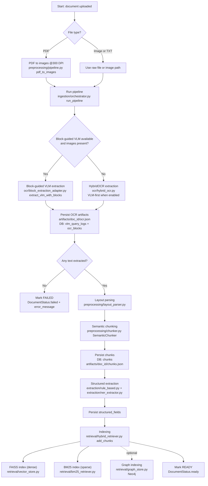

# GLDIS Architecture

This document describes the *implemented* architecture of **GLDIS (Grounded Legal Document Intelligence System)** as it exists in this repository. It focuses on runtime components, data flow, and where to find the code.

## Runtime entrypoint

- **Backend:** `main.py` (FastAPI)
  - Creates data directories and DB tables on startup (`core.config.Settings.ensure_dirs()`, `db.session.create_tables()`).
  - Mounts API routers from `routes/`.
  - Serves the built-in UI from `static/` when present.

> Note: There is also an `api/` package containing another FastAPI app (`api/main.py`). The actively used app (tests, README quickstart) is `main.py` + `routes/`. Treat `api/` as *legacy/prototype* unless you intentionally run it.

## Pipeline flowchart

## Pipeline stages (code-accurate)

### 1) Upload (API)
- **Route:** `POST /api/documents/upload` (`routes/documents.py`)
- Persists:
  - File → `./data/uploads/<uuid>.<ext>`
  - DB row → `documents` table

### 2) Process / ingest (pipeline)
- **Routes:**
  - `POST /api/documents/{id}/process` (background task)
  - `POST /api/documents/{id}/process/sync` (blocking)
- **Implementation:** `ingestion/orchestrator.run_pipeline()`

What happens:
- **Preprocessing:** PDF → page images at 300 DPI (best-effort) (`preprocessing/pipeline.py`).
- **HybridOCR routing:** (`ocr/hybrid_ocr.py`)
  - If PDF has a text layer → **PyMuPDF** extraction.
  - Otherwise, if `vlm_enabled=true` and images are available → **VLM-first**, then OCR fallback if confidence is low.
  - OCR fallback chain: **Tesseract → PaddleOCR**.
- **Persistence / artifacts:**
  - Writes `ocr.json`, `layout.json`, `chunks.json` under `./data/artifacts/<document_id>/` (best-effort).
  - Stores VLM audit logs in `vlm_query_logs`.
  - Stores block-level results in `ocr_blocks` and links chunk→block grounding when possible.

### 3) Layout parsing + chunking
- **Layout parsing:** `preprocessing/layout_parser.py` (rule-based heading/clause detection; page markers `--- PAGE N ---` are used when present).
- **Chunking:** `preprocessing/chunker.py`
  - Section-aware packing to a target token budget (approx token counting) with overlap.

### 4) Extraction (structured fields)
- **Rule-based:** `extraction/rule_based.py` (regex patterns for dates, case numbers, money, etc.)
- **NER:** `extraction/ner_extractor.py` (spaCy; disabled gracefully if model not installed)
- Persisted to `structured_fields`.

### 5) Indexing + retrieval
- **Indexing:** `retrieval/hybrid_retriever.HybridRetriever.add_chunks()`
  - **FAISS** (dense) persists under `./data/faiss_index/`.
  - **BM25** (sparse) persists under `./data/bm25_index/`.
- **Query-time retrieval:** `HybridRetriever.search()`
  - Pulls candidates from FAISS + BM25
  - Fuses rankings with **Reciprocal Rank Fusion (RRF)**
  - Optional cross-encoder reranking (lazy-loaded)
  - Optional **GraphRAG expansion** if enabled (see below)

### 6) Draft generation + grounding
- **Route:** `POST /api/drafts/generate` (`routes/drafts.py`)
- Steps:
  1. Retrieve evidence via `HybridRetriever.search()`.
  2. Fetch improvement context (few-shot + style rules) via `feedback/improvement_loop.py`.
  3. Generate using `generation/generator.py`:
     - Prefer a dedicated **reasoner endpoint** if configured.
     - Otherwise use the resolved provider in `llm/client.py`.
     - If all providers fail → mock structured template output (keeps system demoable).
  4. Optional verifier loop (bounded by `max_correction_iterations`).
  5. Compute grounding score + extract inline citations (`generation/grounding.py`).

### 7) Feedback → improvements
- **Route:** `POST /api/feedback` (`routes/feedback.py`)
- Persists edits in `edits` and may promote high-quality edits into `few_shot_examples`.
- Optional Mem0 integration exists (`feedback/mem0_store.py`) with JSONL fallback.

## Data storage (tables you should expect)
Defined in `db/models.py`:
- `documents`, `ocr_blocks`, `chunks`, `structured_fields`
- `drafts`, `edits`, `few_shot_examples`, `vlm_query_logs`

## Feature flags / configuration
Defined in `core/config.py` (loaded from `.env`):
- `database_url` (default: `sqlite:///./data/gldis.db`)
- `vlm_enabled`, `vlm_model`, `vlm_api_base`, `vlm_confidence_threshold`
- `embedding_model`, `faiss_index_path`, `bm25_index_path`
- `reasoning_*` + `verifier_*` + `verifier_enabled` + `max_correction_iterations`
- GraphRAG: `graphrag_enabled` + `neo4j_enabled` + `neo4j_uri/user/password`

## Repo map (high-signal folders)
- `routes/` — public API used by `main.py`
- `ingestion/`, `ocr/`, `preprocessing/`, `extraction/`, `retrieval/`, `generation/`, `feedback/` — pipeline modules
- `static/` — built-in UI served by backend
- `ui/` — optional React/Vite dev UI

---