# GLDIS Architecture — Technical Deep-Dive

## Overview

The Grounded Legal Document Intelligence System (GLDIS) is a 4-stage, modular pipeline. Each stage is independently testable, has clear input/output contracts defined by Pydantic schemas, and degrades gracefully when optional dependencies (MinerU, Neo4j, Mem0, model servers) are unavailable.

---

## Stage Map

```
┌─────────────────────────────────────────────────────────────────┐
│  [1] STAGE 1: INGEST + BLOCK EXTRACTION                         │
│                                                                 │
│  Upload API → preprocessing → OCR/VLM routing → MinerU optional │
│  InternVL2.5 block extraction → real pixel bboxes @ 300 DPI    │
└────────────────────────────┬────────────────────────────────────┘
                             │
┌────────────────────────────▼────────────────────────────────────┐
│  [2] STAGE 2: RETRIEVAL                                         │
│                                                                 │
│  Semantic chunking → FAISS dense + BM25 sparse + GraphRAG       │
│  Neo4j 1–2 hop expansion → fused evidence chunks                │
└────────────────────────────┬────────────────────────────────────┘
                             │
┌────────────────────────────▼────────────────────────────────────┐
│  [3] STAGE 3: REASON + VERIFY                                   │
│                                                                 │
│  DeepSeek-R1 reasoner → structured claim map → Llama-4 verifier│
│  bounded correction loop → grounded draft + citations          │
└────────────────────────────┬────────────────────────────────────┘
                             │
┌────────────────────────────▼────────────────────────────────────┐
│  [4] STAGE 4: MEMORY + LEARNING                                 │
│                                                                 │
│  Mem0 feedback memory → operator edit capture → DPO JSONL export│
│  offline preference tuning dataset                              │
└─────────────────────────────────────────────────────────────────┘
```

---

## Stage Details

### Stage 1 — Upload + block extraction

- Accepts PDF, PNG, JPEG, TIFF, BMP, TXT
- Assigns UUID, stores file, creates `Document` DB record
- Returns `document_id` for all subsequent calls
- Processing triggered via `POST /api/documents/{id}/process/sync`
- PDF preprocessing renders at 300 DPI; optional MinerU provides layout blocks
- VLM-guided extraction crops each block and returns real `bbox=[x1,y1,x2,y2]` values
 - Routing and fallback behavior (implemented in `ingestion.orchestrator` and `ocr.hybrid_ocr`):
     - For image-based pages, the pipeline is VLM-first when `VLM_ENABLED=true`. It first attempts MinerU-guided block extraction (block adapter). If MinerU or block-guidance is unavailable the system falls back to full-page VLM extraction.
     - If VLM confidence is below `vlm_confidence_threshold` the pipeline falls back to OCR engines.
     - For digital PDFs with an embedded text layer the pipeline uses `PyMuPDF` (lossless). For scanned pages the OCR chain is: Tesseract → PaddleOCR (if Tesseract average confidence < 0.6 or not installed).
     - All steps are best-effort and non-fatal where possible: failures are logged and the pipeline continues with the next available engine.

### Stage 2 — Retrieval (`retrieval/`)

| Component | Technique | Notes |
|-----------|-----------|-------|
| Dense retrieval | FAISS `IndexFlatIP` | existing embeddings remain unchanged |
| Sparse retrieval | BM25 / token-overlap fallback | `BM25Store` uses `rank_bm25` when installed, otherwise falls back to a deterministic token-overlap scorer |
| Dense retrieval | FAISS (embedding required) | `FAISSStore` requires `sentence-transformers`; if embeddings cannot be generated the index additions/searches are skipped and the retriever falls back to sparse-only results |
| Reranking | Cross-encoder (optional) | Cross-encoder reranker is loaded lazily; if the package is missing the system logs a warning and skips reranking |
| Graph expansion | Neo4j + APOC | chunk neighborhood traversal for 1–2 hops |
| Fusion | Reciprocal Rank Fusion | combines dense, sparse, and graph-derived evidence |

### Stage 3 — Reasoning + verification (`generation/`)

- Reasoner endpoint: `DeepSeek-R1-Distill-Llama-70B` via an OpenAI-compatible server
- Verifier endpoint: `Llama-4-8B` via an OpenAI-compatible server
- Output contract: `draft_markdown` plus structured claim map for audit and repair
- Verification loop is bounded to 1–2 iterations and only rewrites the draft when the verifier finds unsupported claims
 - Provider selection and fallbacks (implemented in `llm.client` and `generation.generator`):
     - The system resolves an LLM provider using `LLM_PROVIDER` (explicit override), or infers a provider from available API keys and flags. By default it prefers LM Studio for vision-mode and OpenAI if `OPENAI_API_KEY` is configured.
     - `DraftGenerator` will call a dedicated reasoner endpoint if configured; otherwise it calls the resolved provider. If the provider call fails, the generator falls back to a local mock generator that produces a structured template (ensures the UI remains demonstrable).

### Stage 4 — Memory + learning (`feedback/`)

- `Mem0Store` captures feedback memory when the optional package is present, otherwise falls back to JSONL persistence
- `dpo_export.py` emits edit pairs as JSONL for offline preference tuning
- Existing edit capture and diff analysis remain the source of training examples

**Category heuristics:**
| Edit type | Signal |
|-----------|--------|
| `hallucination` | Original had hedges (`likely`, `probably`), edited has specifics |
| `missing_fact` | Large insertion with dates/amounts/names |
| `incorrect_fact` | Replacement of specific values |
| `poor_structure` | Many insertions/deletions uniformly distributed |

---

## Data Models (`db/models.py`)

| Table | Key fields |
|-------|-----------|
| `documents` | id, filename, status, page_count |
| `chunks` | chunk_id, document_id, text, page, section, token_count |
| `ocr_blocks` | block_id, document_id, text, bbox, block_type |
| `structured_fields` | document_id, field, value, confidence |
| `drafts` | draft_id, document_id, generated_text, evidence_used, citations, grounding_score |
| `edits` | edit_id, draft_id, original_text, edited_text, edit_diff, feedback_type |
| `vlm_query_logs` | id, document_id, image_path, prompt, response, model_used |

---

## Schemas (`core/schemas.py`)

Key Pydantic models shared across all stages:


---

## Grounding Strategy (3 Layers)

| Layer | Where | Mechanism |
|-------|-------|-----------|
| **Generation-time** | Prompt | system rules + evidence-only instruction + structured claim map |
| **Evidence injection** | Prompt | chunked evidence with source and page headers |
| **Post-hoc verification** | `grounding.py` + verifier loop | Jaccard overlap score + verifier corrections + bounded rewrite |

---

## Scaling Considerations

| Concern | Current | Production upgrade |
|---------|---------|-------------------|
| Vector index | FAISS Flat (exact) | FAISS IVF or HNSW for >1M vectors |
| Database | SQLite | PostgreSQL (set `DATABASE_URL`) |
| Processing | Synchronous | Celery + Redis task queue |
| Embedding | In-process | Dedicated embedding microservice |
| LLM | Reasoner + verifier HTTP calls | batched async calls with semaphore |

---

## Fallbacks & Graceful Degradation (Detailed)

This project is designed to be usable with a minimal local environment and to improve functionality when optional dependencies are available. The core principle is "best-effort, degrade gracefully": the system logs missing components, skips the unavailable feature, and continues with a reduced but functional pathway.

- Stage 1 (Document understanding):
    - `vlm_enabled` controls VLM usage. When enabled the adapter attempts MinerU block detection; missing MinerU results in full-page block fallback. Low VLM confidence (below `vlm_confidence_threshold`) triggers an OCR fallback.
    - Digital PDFs use `PyMuPDF`. If `fitz` is unavailable the system will attempt image-based OCR on rendered pages.
    - The OCR chain prefers `pytesseract` (Tesseract). If not installed or confidence is low, `paddleocr` is used when available. If no OCR engines are present the pipeline returns an informative error and the document is marked `failed`.

- Stage 2 (Retrieval):
    - BM25 uses `rank_bm25` when installed; otherwise a simple token-overlap scorer is used. This guarantees sparse retrieval even on systems without `rank_bm25`.
    - Dense retrieval and indexing require `sentence-transformers` and FAISS. If embeddings cannot be computed the system skips FAISS indexing/search and continues with BM25-only retrieval.
    - Cross-encoder reranking and Neo4j GraphRAG are optional enhancements. Missing packages or disabled flags cause these steps to be skipped with warnings.

- Stage 3 (Generation & Verification):
    - LLM provider resolution prefers explicit `LLM_PROVIDER` but will fall back to OpenAI when an API key is present, or LM Studio otherwise. Vision-mode forces LM Studio routing where applicable.
    - If a dedicated reasoner/verifier endpoint is configured the generator will use it; otherwise it uses the resolved provider. Any failures in LLM calls are caught and trigger the `mock` generator fallback to ensure a structured output.
    - Verifier iterations are bounded by `max_correction_iterations` and may be disabled via `verifier_enabled`.

- Stage 4 (Memory & Feedback):
    - `Mem0Store` uses the `mem0` package when installed; otherwise it falls back to a file-based JSONL store under `feedback_store_path`.

- Operational behavior & observability:
    - All optional components are loaded lazily and guarded by import checks. Warnings are emitted to logs when components are unavailable; non-critical failures are handled with try/except and the pipeline continues where possible.
    - Artifacts (OCR JSON, layout, chunks, drafts) are written to `data/artifacts/<document_id>/` when possible to aid debugging and to provide reproducible inputs for offline runs.

## Fallback Diagrams

The diagrams below summarize the runtime routing and fallback logic for Stage 1 (Document understanding) and Stage 3 (Generation). They match the behavior implemented in `ocr.hybrid_ocr`, `ocr/block_extraction_adapter`, and `generation/generator`.

```mermaid
flowchart TD
    subgraph S1["Stage 1 - Document Understanding"]
        A["Start: uploaded doc"] --> B{"Is PDF with text layer?"}
        B -- Yes --> C["PyMuPDF (digital PDF) -> Done"]
        B -- No --> D{"Images available and VLM enabled?"}
        D -- Yes --> E{"MinerU block guidance available?"}
        E -- Yes --> F["VLM block extraction"]
        E -- No --> G["VLM full-page extraction"]
        F --> H{"avg_conf >= vlm_confidence_threshold"}
        G --> H
        H -- Yes --> I["Use VLM output -> Continue"]
        H -- No --> J["Tesseract OCR"]
        J --> K{"avg_conf >= 0.6"}
        K -- Yes --> L["Use Tesseract output -> Continue"]
        K -- No --> M["PaddleOCR if installed -> Continue"]
        M --> N["If no OCR engines -> Mark failed"]
    end

    subgraph S3["Stage 3 - Generation and Verification"]
        X["Start: Draft request + evidence"] --> Y{"Reasoner endpoint configured?"}
        Y -- Yes --> Z["Call Reasoner -> Success?"]
        Z -- Yes --> Z1["Use Reasoner output"]
        Z -- No --> P["Call resolved LLM provider"]
        Y -- No --> P
        P --> Q{"Provider call succeeded?"}
        Q -- Yes --> Q1["Use provider output"]
        Q -- No --> R["Mock generator -> Structured template"]
        Q1 --> S["Optional verifier loop (bounded by max_correction_iterations)"]
        Z1 --> S
        S --> T["Finalize draft + grounding checks"]
    end
```




